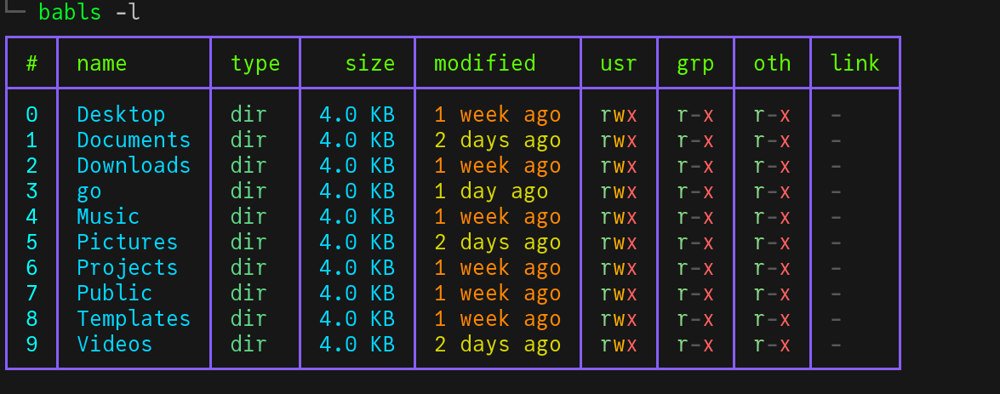

This repository contains babashka scripts.

## [babls](babls/babls)

`ls` in Babashka, heavily inspired by the nushell ls.

> **AI Disclosure:** Generative AI was heavily used in the production of this particular utility.

**Usage Instructions:**
1. To use this, just download the file and place it in `~/.local/bin` folder.
2. Then make it executable, by doing: `chmod +x ~/.local/bin/babls`.

**Note**: Make sure the `~/.local/bin` folder is on PATH, which is the default on most distros. You need babashka installed for this to work.



## [babls](babls/babls)

Modern bash prompt, written and configurable in Babashka, heavily inspired by [pkazmier's bash prompt](https://github.com/pkazmier/bash-prompt)


> **AI Disclosure:** Generative AI was heavily used in the production of this particular utility.

**Usage Instructions:**
1. To use this, just download the file.
2. Then source it from the `~/.bashrc` by adding this:
```bash
if [[ -n $PS1 && -f /path/to/babash_prompt ]]; then
  export BASH_PROMPT_THEME=colorful   # dark|white|blue|green|yellow|red
  . /path/to/babash_prompt
fi
```
3. You can define new themes in the `themes` function, under `(def themes`. Then use these by exporting them in the `~/.bashrc`. The default example uses the `colorful` theme defined in the file.
